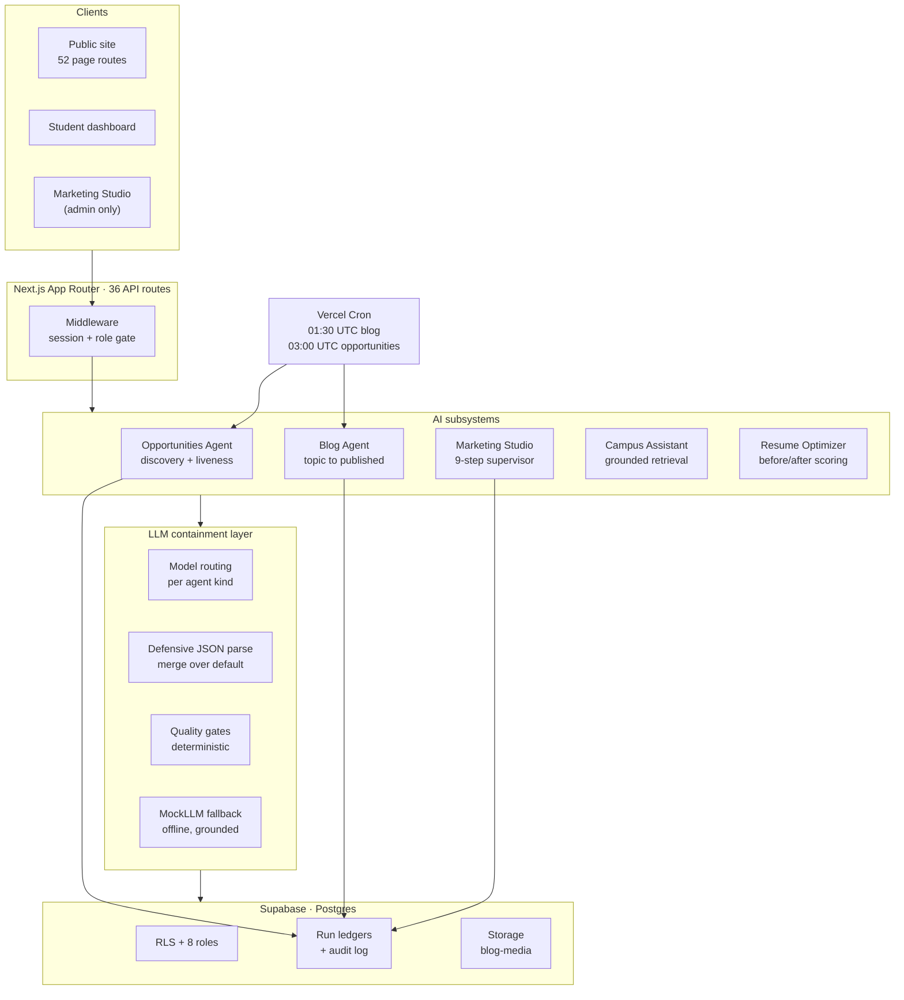

# Architecture

How BVCITS 2.0 is put together, and — more usefully — the failure each design decision was
a response to. Where a choice looks unusual, the reason is stated rather than implied.

**Thesis:** a language model is an unreliable component. The interesting engineering is not
the prompt; it is the machinery around the model that makes an unreliable component safe to
put in front of real students making real decisions.

---

## 1. System map



Everything runs on one Next.js deployment. There is no separate agent runtime: the agents
are server-side modules invoked by cron routes and by admin actions, which keeps the
deployment surface to one thing that can be built and verified in a single `npm run build`.

---

## 2. Agent architecture

### The orchestration pattern

Each multi-step agent follows the same spine:

```
open ledger row → run stages in order → record each stage → gate → close ledger row
```

Two properties fall out of that ordering and both are deliberate.

**The ledger row opens before any work happens.** A run that dies halfway is then visible as
a failed run rather than vanishing as though the agent never woke up. Silence and failure
must not look the same from the console.

**The gate sits before the terminal state, not after.** Publishing is not the last step of
generation; it is a separate transition that generation cannot perform.

### The state machine

`src/lib/marketing/state-machine.ts` defines legal campaign transitions as an explicit
adjacency map. The important entry is the one that is **absent**:

```
READY_FOR_REVIEW → PUBLISHED    ✗ not in the table
```

There is no path from "the agents finished" to "it is live." Approval is a human transition.
This is enforced twice — in the state machine, and again server-side at publish time —
because the studio has a natural-language assistant and a single enforcement point would be
a single thing to talk past.

Related rule: any content edit after approval **invalidates** the approval
(`invalidatesApproval`). Otherwise "approved" would mean "approved at some earlier point,
for content that no longer exists."

One transition in that table is worth reading as a bug fix rather than a design:
`GENERATING → CHANGES_REQUESTED` exists because that is exactly what the quality gate does
when it finds critical issues — content exists, but it needs work. Omitting it stranded
campaigns: the gate threw mid-pipeline, the run aborted, and `GENERATING` had no outbound
path an admin could take, so the campaign was unrecoverable.

---

## 3. Containing the model

Four independent layers. Each assumes the previous one failed.

### Layer 1 — Routing and default-to-deterministic

`providers/llm.ts` defines an `LlmProvider` interface with per-agent-kind routing
(`extraction`, `strategy`, `writing`, `seo`, `quality`, `creative`, ...), so a cheap model
can serve extraction while a stronger one serves writing.

**`MockLLM` is the default, not a test double.** It is fully deterministic and offline, and
composes every generation from campaign facts, so no hallucination is possible. The
OpenAI-compatible provider activates only when env keys exist. Consequence: the repository
clones and runs with no API keys at all — the agents degrade to deterministic paths rather
than crashing.

### Layer 2 — Never trust the shape of model JSON

A model asked for JSON returns *something like* JSON: wrapped in a markdown fence, nested
under a descriptive key, renamed to snake_case, or missing fields — all while remaining
syntactically valid, so `JSON.parse` succeeds and an unchecked `as T` cast lets the
malformed object straight through.

That is precisely how a live campaign died. Gemini returned:

```json
{ "campaign_strategy": { "objective": "...", "key_messaging": { } } }
```

instead of the flat shape with `platformStrategy`. The cast passed. The writing agent then
crashed on `strategy.platformStrategy["instagram"]`, taking SEO and the quality gate down
with it.

`providers/llm-json.ts` fixes this structurally: strip fences, normalise keys
(`platform_strategy`, `Platform Strategy` → `platformstrategy`), **merge over a known-good
default**, and report what had to be repaired so the repair is visible rather than silent.

### Layer 3 — Deterministic quality gates

Verification never asks a model to check model output. The blog gate
(`blog/agents/quality-agent.ts`) checks:

- **Fabricated figures** — rupee amounts, percentages and large counts are extracted by
  regex and matched against the grounded fact set. A wrong adjective is a style problem; a
  wrong placement percentage is a false claim about a real institution.
- **Slop phrases** — ~24 tells ("in today's fast-paced world", "delve into", "game-changer")
  and repeated connective openers. Individually warnings; collectively they tank the score
  and force a revise pass.
- **Grounding** — prose is matched against `college-context.ts`, plus an explicit
  `FORBIDDEN_CLAIM_PATTERNS` list.

A `critical` issue blocks auto-publish and stops the post in `NEEDS_REVIEW`. An admin can
override — with their name attached.

### Layer 4 — Never return something worse than the input

`resume/pipeline.ts` runs three candidates through the *same* scoring function — the model
rewrite, a deterministic rewrite, and the untouched original — and keeps the best.

This exists because a model rewrite can lose ground (dropping a keyword, flattening a bullet
that already had a number), and shipping that produced the nonsense of a "−2 pts
improvement" badge. Scoring before and after with one function is what makes the improvement
claim mean anything.

---

## 4. The Opportunities Agent — a trust-and-safety pipeline

The subsystem whose logic generalises furthest beyond this project.

```
search (allowlisted domains) → fetch → extract → verify → dedupe → rank → publish
                                          │
                              ┌───────────┼───────────┐
                            trust      seniority    region
```

### Why three gates instead of one score

Trust, seniority and reachability are independent questions, and collapsing them into one
score makes it impossible to say *why* something was rejected. Each is a separate module
with its own tests.

The region gate was added after the first live runs published perfectly trustworthy,
perfectly student-level listings that were useless to the reader — NVIDIA Santa Clara, Meta
Menlo Park, SpaceX Hawthorne, FedEx Memphis. A BVCITS undergraduate cannot apply to a US
on-site internship, so a board full of them is a board with nothing on it. Every existing
gate was working correctly; the missing gate was a question nobody was asking.

### Asymmetric cost, asymmetric filter

The filter is deliberately biased toward rejecting:

> A student who misses one real opportunity loses one opportunity. A student who pays ₹2,000
> to a fake "placement drive" loses money and trust in the portal.

The two error types are not equally bad, so the threshold is not symmetric.

### Identity and deduplication

The same posting arrives as `.../job/123?utm_source=linkedin`, `.../job/123/`, and
`HTTPS://WWW.Host/job/123#apply`. Untreated, that is three rows and the student sees the
same internship three times.

- `canonicalizeUrl` strips ~18 tracking params, lowercases the host, drops `www.`, sorts the
  query and trims trailing slashes. Returns `null` for anything not `http(s)` — a
  `javascript:` "apply link" is not a URL that will ever be rendered.
- `urlFingerprint` ignores the scheme, so http and https copies collide into one row.
- `contentFingerprint` is the secondary identity for when URLs genuinely differ (the same
  drive on the company site and on Internshala): normalising punctuation, years and role
  noise makes "Google STEP Internship 2026" and "google step internship" collide.

### Liveness: interpreting responses, not just fetching them

The hard part is not the fetch, it is deciding what a response *means*. Two easy mistakes,
both costly:

- **403 is not death.** Corporate career sites answer an unknown User-Agent with 403 while
  serving browsers perfectly — `cummins.com` did exactly this in an early run. Retiring on
  403 removes precisely the official sources the feed exists to carry.
- **One ambiguous failure is not death.** Consecutive failures are counted; retirement needs
  persistence, not a single bad night.

Retirement is soft (`retired_at` + `retired_reason`), never a delete: the row still matters
for deduplication and for a student who already applied.

### Ranking is explainable by construction

The score is computed at read time from the student's profile — the same internship ranks
differently for a final-year CSE student and a second-year Civil student — and it returns
its `ScoreBreakdown` (source, urgency, profile, kind, freshness) alongside the total, so the
UI shows "Closes in 3 days · Matches CSE" instead of a magic number.

Department matching is plain-text keyword matching rather than embeddings, deliberately: it
is inspectable, it costs nothing per request, and when it is wrong a human can see exactly
which word did it.

---

## 5. Reliability

The publish queue (`marketing/queue.ts`) is the most infrastructure-shaped component:

| Concern | Mechanism |
|---|---|
| Double-publish on retry | Idempotency key = `(campaignId, platform, version)` |
| Transient vs permanent failure | `classifyError` — only transport/rate-limit errors retry |
| Retry storms | Exponential backoff, 30s base → 1h cap, max 5 retries |
| Worker dies mid-publish | `lockedUntil` crash lock (45s), so a dying worker never double-publishes |
| Scheduling | Remote scheduling where the platform supports it (Instagram/Facebook); caller-side due-time publishing otherwise |

Retrying only transport and rate-limit errors is the load-bearing distinction: retrying a
validation failure five times with backoff turns a bad request into an hour of wasted calls
and still fails.

---

## 6. Data and security model

**Postgres via Supabase, 13 migrations.** Schema changes are migrations, never ad-hoc edits.

**Eight roles**, derived from the seven stakeholder portals plus `admin`, so a signed-in
user's role maps onto the portal they already navigate to — authentication layers onto the
existing IA instead of inventing a second one. The TypeScript union is *derived from the
runtime array*, so the list the UI renders and the type the code checks cannot drift.

**RLS is the enforcement point, not the UI.** The publishable key is safe in the browser
because RLS is enabled with no permissive policies — that key can only call the two
`SECURITY DEFINER` RPCs granted to `anon`. The secret key bypasses RLS entirely and is
server-side only; agents that write on behalf of a cron use the service client because there
is no user attached to a scheduled run.

**Cron routes are closed by default.** With `CRON_SECRET` unset, the opportunities route is
*closed*, not open. The route fires dozens of outbound requests per call, so an
unauthenticated version is a denial-of-wallet hole. Admins can still trigger a run through
their session instead.

**Audit trail.** Agent runs, status changes and publishes append to an audit log with actor,
action, entity and detail. An agent actor is recorded as `agent:<name>`, so machine actions
and human actions are distinguishable after the fact.

---

## 7. Testing

**597 tests across 36 files** (`npm test`, Vitest).

The testable-by-construction rule: **gates are pure functions and I/O is injected.**
`opportunities/verify.ts` performs no network calls — reachability is passed in, and `now`
is a parameter. That is what allows scam-detection rules and deadline logic to be tested
deterministically without hitting the internet or waiting for a date to pass.

Coverage concentrates where correctness is safety-relevant rather than spreading evenly:
trust/liveness/region gates, quality gates, the state machine, defensive JSON parsing, role
capabilities, and resume scoring.

---

## 8. Failure log

Every entry is a real defect found by running the system, and the design decision it forced.
This section is the honest core of the document.

| Failure observed | Root cause | Structural fix |
|---|---|---|
| Campaigns stranded, unrecoverable | Quality gate threw mid-pipeline; `GENERATING` had no outbound path | Added `GENERATING → CHANGES_REQUESTED` + a manual `DRAFT` escape hatch |
| Writing agent crashed, took SEO and quality down | Model nested output under `campaign_strategy`; `as T` cast passed it through | Defensive parse: normalise keys, merge over default, report repairs |
| Feed full of unreachable US on-site roles | Trust and seniority passed; reachability was never asked | Added `region.ts` as a third independent gate |
| Official career sites disappearing from the feed | Liveness treated 403 as dead | 403 is ambiguous, not dead; require consecutive failures |
| Section image rendered as a document scan with GPS stamps | "Activity report" collage sheets were in the photo pool | Gutter detector on a 64×64 greyscale probe |
| "−2 pts improvement" badge | Model rewrite scored worse than the original and shipped anyway | Score three candidates, keep the best |
| Telugu queries silently shredded | Tokenizer used `\p{L}` without `\p{M}` | Include combining marks |
| Fabricated HOD names shipped as fact | Content invented where data was missing | Grounded fact set + forbidden-claim patterns; treated as a correctness bug |

---

## 9. Known limits

Stated plainly, because a system's boundaries are part of its description.

- **No labelled evaluation set.** The trust gates are unit-tested against hand-written cases,
  not measured as precision/recall against a labelled corpus. Turning the rejection log into
  a labelled set is the obvious next step and would make the filter's quality measurable
  rather than argued.
- **Discovery breadth is allowlist-bound.** Searching inside a trusted domain list beats
  filtering an open crawl for precision, and costs recall. That trade is deliberate but it is
  a trade.
- **Single-region deployment**, single Postgres. No sharding or read replicas; correct at
  current scale and would need revisiting well before it wasn't.
- **`departments.ts` still carries placeholder staff names** for some departments, pending
  migration to `real-departments.json`.
